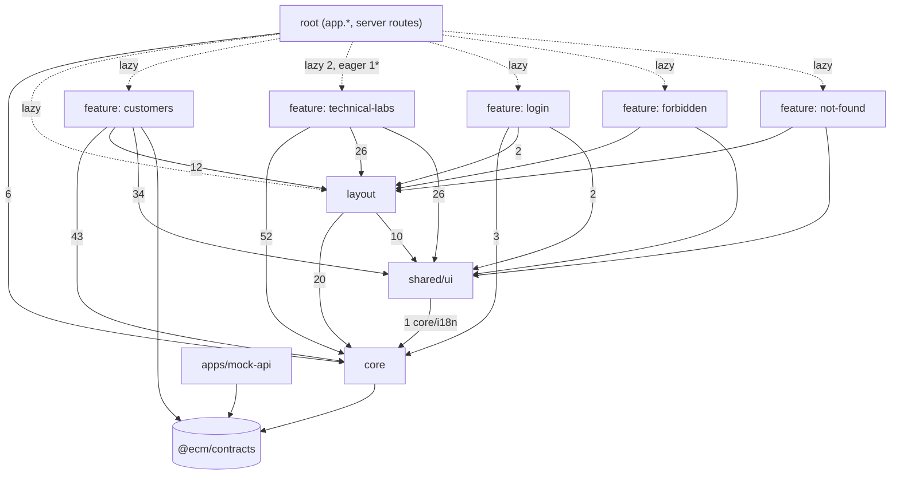
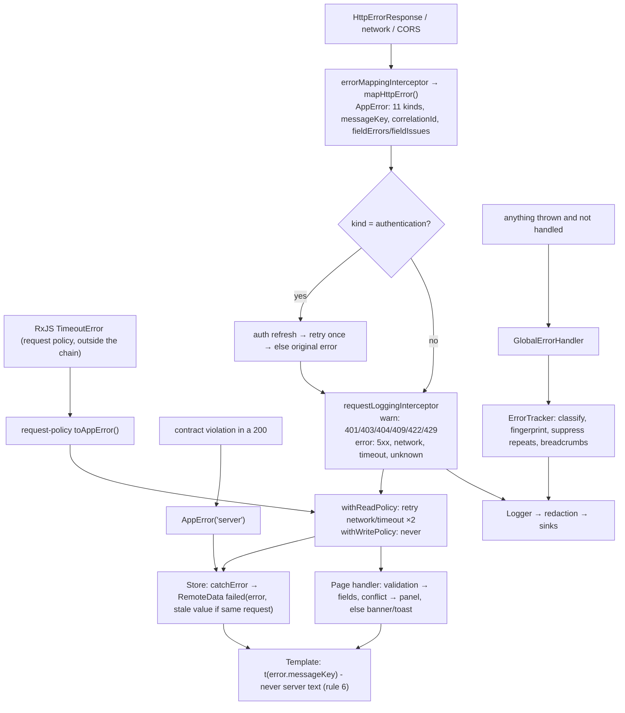
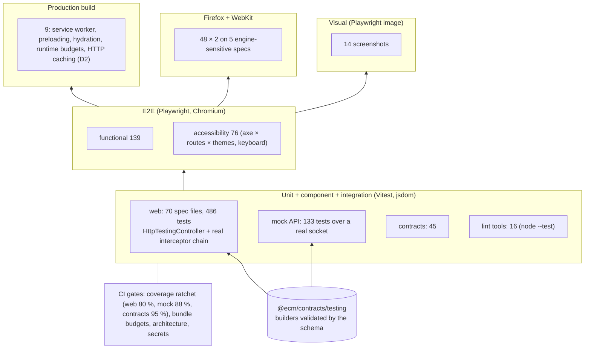

# Enterprise review — `phase-8`

A staff-level review of the whole repository, written for one reader: an engineer who
will join a large Angular codebase tomorrow and wants to know **which ideas from this
repository they can take with them as they are, which are simplified because this is a
learning project, and which must not be copied without thought.**

It is not a second copy of the documentation. Where a design is already explained
elsewhere, this report says whether it held up under review and points to the
explanation. Every finding is tied to a file and line and backed by evidence, either a
test, a command's output or a reproduction. No finding gets a numeric quality score. A
finding's priority says how soon it should be acted on, and nothing more.

**How the review was done.**

- Read every root-provided service, the customer feature end to end (routes, API client,
  request policy, store, cache, realtime sync, form, list), the session and HTTP layers,
  the SSR server and the mock API's security middleware.
- Ran the tools the repository has: `lint/architecture.ts` (and `--graph`), the unit,
  E2E and production suites.
- Probed what static reading cannot settle: the production server's response headers
  (`curl`), and the email-availability check against a running mock API.
- Grepped the whole web app for outdated or rule-breaking patterns. Results are in
  section 4.2.

**What it changed.** Four defects were fixed, each with a test that failed before the
fix, and Angular was moved to 22.2.1 for a security advisory that CI caught (section 3). Nothing else in production code was touched.

---

## Contents

1. [The answer: what transfers, what is simplified, what not to copy](#1-the-answer)
2. [Architecture maps](#2-architecture-maps)
3. [Defects fixed by this review](#3-defects-fixed-by-this-review)
4. [Findings by area](#4-findings-by-area)
5. [Cross-checking earlier claims](#5-cross-checking-earlier-claims)
6. [Technical debt, reconciled](#6-technical-debt-reconciled)
7. [Recommended order of work](#7-recommended-order-of-work)

---

## 1. The answer

> _If I joined a large Angular enterprise project tomorrow, which concepts from this
> repository would transfer directly, and which are simplified because this is a
> learning project?_

### 1.1 Transfers directly

These hold in a team of fifty as they do here. In most large codebases the problem is
not that the team never heard of them. It is that the team stopped enforcing them.

| Concept                                                                                       | Where it is here                                                   | Why it transfers                                                                                                                                                                                         |
| --------------------------------------------------------------------------------------------- | ------------------------------------------------------------------ | -------------------------------------------------------------------------------------------------------------------------------------------------------------------------------------------------------- |
| **Layering: component → feature state → API client → `HttpClient`**                           | `customers/` (`data/`, `state/`, pages); rule 3                    | It is the rule large codebases lose first, and the hardest to restore later. Here it is enforced, not described (`lint/architecture.ts`, rule `http-only-in-api-clients`)                                |
| **Boundaries checked by a tool, in CI**                                                       | `lint/architecture.ts`, ADR-0041                                   | 333 files, 912 imports, 0 cycles, 12 rules. A boundary that is only written down erodes one pull request at a time. The tool is 500 lines; Nx's module-boundary rule or `dependency-cruiser` do the same |
| **One contract, validated at the edge**                                                       | `@ecm/contracts` (Zod), `parseWith` in `customer.api.ts`           | The inferred type is the type, and a malformed 200 becomes a `server` error at the boundary, not `undefined` three components later. With OpenAPI codegen the mechanism changes but the principle stays  |
| **An error taxonomy; no raw server text on screen**                                           | `core/errors/app-error.ts`, `error-mapping.interceptor.ts`; rule 6 | Features reason about `conflict`, never about `409`. Translation, logging and alerting all key off the same 11 kinds                                                                                     |
| **Interceptors with one job each, ordered on purpose**                                        | `core/http/http.providers.ts`                                      | The order is written down and every position has a reason. An interceptor chain is the most common place where hidden coupling grows                                                                     |
| **Retry and timeout set per endpoint, by intent**                                             | `customers/data/request-policy.ts`                                 | "Reads retry, writes never" in the name of the operator is what stops the duplicate-payment bug. (Its location needs to move; see API-2)                                                                 |
| **Single-flight refresh, generation counter, one retry**                                      | `session.service.ts`, `auth-refresh.interceptor.ts`, ADR-0017      | Correct handling of concurrent 401s and rotated refresh tokens, across tabs with Web Locks. Most hand-written refresh interceptors get this wrong                                                        |
| **`HttpOnly` cookies; the app never holds a token**                                           | ADR-0016                                                           | The right default for a browser application served same-origin                                                                                                                                           |
| **Optimistic concurrency (`version`) and a 409 that keeps both edits**                        | ADR-0015, `customer-form-page.ts`                                  | It is how a record edited by several people in parallel stays correct                                                                                                                                    |
| **URL as the state of a list**                                                                | `customer-list-criteria.ts`, ADR-0013                              | Shareable, bookmarkable, back-button-safe. This is what users expect from enterprise grids                                                                                                               |
| **Route-scoped feature state**                                                                | `customers.routes.ts` `providers`                                  | Customer data dies with the section and with the session. Making a store `providedIn: 'root'` is the leak that causes "I saw the previous user's data"                                                   |
| **Permission-based (not role-based) checks, at route, UI and action**, labelled UX            | `requirePermission`, `*appIfPermitted`, `refuseUnless`; rule 10    | Adding a role does not mean editing routes. The client never computes its own permissions                                                                                                                |
| **Feature flags: runtime vs build-time, with validated config**                               | ADR-0040                                                           | The distinction between deciding behaviour (a runtime flag) and excluding code from the build (a build-time flag) holds at any scale                                                                     |
| **Structured logs, redaction inside the logger, correlation ids end to end**                  | ADR-0038, docs/observability.md                                    | Exactly what a log platform needs. Redaction before any sink is the only placement that a new sink cannot bypass                                                                                         |
| **Budgets as CI gates, ratcheted** (bundle and runtime)                                       | `perf/`, ADR-0025                                                  | A budget that does not fail the build is a dashboard nobody reads                                                                                                                                        |
| **Accessibility as tests**: axe on every route and theme, keyboard journeys, focus management | `e2e/accessibility.spec.ts`, `keyboard.spec.ts`, ADR-0037          | Done this way it is a regression suite, not a one-off audit                                                                                                                                              |
| **ADRs and a debt register that names an owner and a date**                                   | `docs/decisions/`, `docs/PROGRESS.md`                              | Six months later, "why is it like this" has an answer                                                                                                                                                    |

### 1.2 Simplified because this is a learning project

Each of these is a correct _shape_ at a smaller scale. A real project needs the larger
version.

| Here                                                         | In a large enterprise project                                                                                                                                                                                                                                            |
| ------------------------------------------------------------ | ------------------------------------------------------------------------------------------------------------------------------------------------------------------------------------------------------------------------------------------------------------------------ |
| One business feature (`customers`)                           | Dozens, owned by different teams. The architecture check becomes per-team ownership (`CODEOWNERS`) plus library boundaries (Nx tags, or package boundaries in a workspace). Locked out here by ADR-0001, and right at this size                                          |
| A hand-written store and cache, ~800 lines                   | Fine for one feature with a cache policy you can explain. At ten features, use one shared server-state primitive (Angular `resource()`/`httpResource()` once stable, TanStack Query, or NgRx SignalStore with an entity adapter), or every team will write its own cache |
| `lint/architecture.ts`, 500 lines of custom code             | `@nx/enforce-module-boundaries` or `dependency-cruiser`, plus `CODEOWNERS`. Writing your own is a teaching choice, not a recommendation                                                                                                                                  |
| Mock API in Express, in memory                               | A real backend, contract tests against it (Pact, or schema checks in its CI), and a mock only for front-end development (MSW or this kind of server)                                                                                                                     |
| Contracts in a shared TypeScript package                     | Usually generated from the backend's OpenAPI. The rule stays the same: one source of truth and validation at the edge. The repository's twist, Zod at runtime, is worth keeping                                                                                          |
| `ErrorTracker` and log sinks that reach the console only     | Sentry, Datadog or Application Insights behind the same seam, with source maps uploaded by CI and sampling. Debt 32                                                                                                                                                      |
| Feature flags from `config.json`                             | A flag service with targeting and an audit trail (LaunchDarkly, Unleash). `FeatureFlags` becomes its adapter                                                                                                                                                             |
| One SSR server (`server.ts`) with no headers, no compression | A CDN and reverse proxy own caching, compression, TLS and security headers. The application server is behind it. This review found that the scaffold's default caching was wrong even at this scale (D2)                                                                 |
| Two locales, bundled                                         | Many locales, a translation-management system, translations fetched per locale, and pseudo-localisation in CI                                                                                                                                                            |
| Visual regression with 14 screenshots, in Docker             | Usually a hosted service (Chromatic, Percy) on a Storybook. Running locally in Docker, as here, is the cheap version of the same idea                                                                                                                                    |
| Branches `phase-0` … `phase-8`, `master` untouched           | Trunk-based development, short-lived branches, protected `main` with required checks (DX-1)                                                                                                                                                                              |

### 1.3 What should remain simple

The review looked for places to add structure and in these places recommends against
it:

- **No mapping layer between DTO and domain** (ADR-0014). The contract type is the
  domain type. A mapper earns its place only when the two really diverge.
- **No store library** for one feature (ADR-0023). The store's 700 lines are policy
  (what to invalidate, when to refetch, what never to overwrite). A library would
  not have removed any of it.
- **No generic "base API service"** or repository abstraction. `CustomerApi` is a list
  of honest methods. API-2 asks for one small shared policy module, not a framework.
- **No component library wrapper over a component library.** `shared/ui` is
  hand-written on the CDK because Material is locked out. In a real project, use the
  company design system directly; do not wrap it "in case".
- **The interceptor count.** Five, each with one job. Resist a sixth that "adds headers
  for everything".

### 1.4 What should be more enterprise-like

Ranked by what it would cost to discover in production:

1. **Security headers and CSP on the document** (SEC-1, SEC-2, debt 17). The API sets
   them and the application document sets none. This is the largest gap between the
   repository and a real deployment.
2. **One request policy for every caller** (API-2). Today the session check has no
   timeout, so a hung server leaves the first navigation pending for ever.
3. **A protected default branch with required checks** (DX-1, debt 33). CI exists and
   blocks nothing.
4. **Exact-match lookups instead of search-based checks** (API-1).
5. **Smaller units of change in the customer feature** (MAINT-1). The list page has 13
   injected dependencies.

### 1.5 What NOT to copy blindly into a production project

| Do not copy                                                                                                                                                | Why                                                                                                                                                                                                                                                       |
| ---------------------------------------------------------------------------------------------------------------------------------------------------------- | --------------------------------------------------------------------------------------------------------------------------------------------------------------------------------------------------------------------------------------------------------- |
| **The mock API's conveniences**: no password check, `x-mock-scenario` fault injection honoured on every request, `/api/_mock/*` admin routes with no guard | They exist so tests can be deterministic. Any of them in a real server is a vulnerability. The mock's CSRF compare is also not constant-time, and its rate limiter is fixed-window (debt 6)                                                               |
| **`server.ts` as scaffolded by the Angular CLI**                                                                                                           | It cached `config.json` for a year (fixed, D2) and still sets no security headers (SEC-2). The CLI's scaffold is a starting point, not a deployment                                                                                                       |
| **Comment density and phase history in code**                                                                                                              | Every file here explains itself at length, and many comments cite a phase or a debt row. That is right for a teaching repository. In a product the history belongs in commit messages and ADRs, because comments rot (MAINT-2 shows one that already had) |
| **Technical labs inside the application**                                                                                                                  | They are behind a flag and are architecturally isolated, but they still ship in the same deployable. A product puts experiments in a separate app or a Storybook                                                                                          |
| **A hand-written architecture checker**                                                                                                                    | Use a maintained tool (section 1.2)                                                                                                                                                                                                                       |
| **The `subscribe` + `takeUntilDestroyed` habit, on writes**                                                                                                | It is right for reads and listeners. On a write it aborts the request whose outcome the client can no longer know. Copy the fix (D1, ADR-0043), not the habit                                                                                             |
| **Measuring performance against a local mock with zero latency**                                                                                           | The budgets here measure a lab (TTFB 8–15 ms). Real-user monitoring of a production deployment is a different number                                                                                                                                      |

---

## 2. Architecture maps

### 2.1 Feature dependency graph

Generated from the imports by `node lint/architecture.ts --graph` at `phase-8`. Each
edge label is the number of import statements. A dotted edge is a lazy `import()` from
the route tree.



\* The eager edge is `app.routes.server.ts` importing the declared entry point
`technical-labs/rendering/rendering-specimens.ts` (server render modes).

**Reading it:**

- No feature imports another feature, and nothing imports a feature except the root,
  through declared entry points. This is enforced, not observed.
- The two arrows into `layout` from every feature are the only structural oddity: see
  ARCH-1.

### 2.2 State ownership map

| State                                       | Owner                                                               | Lifetime                   | Source of truth                       | Synchronisation                                                                                           | Persistence                                          | Reset                                                |
| ------------------------------------------- | ------------------------------------------------------------------- | -------------------------- | ------------------------------------- | --------------------------------------------------------------------------------------------------------- | ---------------------------------------------------- | ---------------------------------------------------- |
| List criteria (page, size, sort, filters)   | Router (URL)                                                        | the address bar            | URL query string                      | `withComponentInputBinding` → `CustomerListPage.criteria` → `effect` → `CustomerStore.setCriteria`        | history / bookmarks                                  | "Reset filters" navigates                            |
| Page of customers                           | `CustomerStore.list` + `CustomerCache` pages                        | `/customers` route subtree | server                                | `switchMap` per criteria; realtime → `applyRemoteChange`; other tabs → `ownChanges$` over `TabChannel`    | memory                                               | destroyed with the route (sign-out leaves the shell) |
| Open customer                               | `CustomerStore.detail` + cache entity                               | `/customers`               | server                                | `selectCustomer`; realtime **flags** (`detailStaleness`), never replaces                                  | memory                                               | route exit; `remove()` sets idle                     |
| Optimistic status in flight                 | `CustomerStore.statusPending`                                       | one request                | the request                           | settled by the response; rollback only over the optimistic object. **Now independent of the caller (D1)** | -                                                    | `finalize`                                           |
| Audit trail                                 | `CustomerStore.audit`                                               | `/customers`               | server, never cached                  | per visit                                                                                                 | -                                                    | route exit                                           |
| Form values, dirty, conflict, server errors | `CustomerFormPage` (+ `customer-form-model.ts`)                     | the page                   | the form, against a `baseline` record | `baseline`/`latest` signals; 409 → reload keeps the user's fields (ADR-0015)                              | none (`beforeunload` + `unsavedChangesGuard`)        | `form.reset(toFormValue(record))` once per record    |
| Selection, bulk report                      | `CustomerListPage`                                                  | the page                   | the page                              | cleared when criteria change; failures stay selected                                                      | -                                                    | criteria change / destroy                            |
| Upload / import / export in flight          | `CustomerAvatar`, `CustomerImportPage`, `CustomerListPage`          | the component              | the transfer                          | progress events; **cancel by unsubscribe, deliberately**                                                  | -                                                    | destroy cancels                                      |
| Session, permissions                        | `SessionService`                                                    | the tab                    | server (`HttpOnly` cookies)           | `restore()` single flight; refresh under a Web Lock; sign-out over `TabChannel`                           | cookies (server-owned)                               | `end()` → `ended$`                                   |
| Notifications, centre history               | `NotificationService`                                               | the session                | itself                                | written from anywhere; read by toast region and bell                                                      | memory                                               | cleared on `ended$`                                  |
| Confirmation on screen                      | `ConfirmationService`                                               | one question               | itself                                | one at a time (ADR-0022)                                                                                  | -                                                    | answer                                               |
| Event stream                                | `RealtimeClient`                                                    | the shell                  | server (SSE)                          | resume from `Last-Event-ID`, de-duplicate, `resync$` when the gap is unknown                              | -                                                    | shell destroy                                        |
| Language, theme                             | `LanguageService`, `ThemeService`                                   | the app                    | `localStorage` (via `LOCAL_STORAGE`)  | other tabs follow (storage event)                                                                         | `localStorage`                                       | user choice                                          |
| Runtime config, flags                       | `AppConfigStore`, `FeatureFlags`                                    | the app                    | `config.json`, validated              | read at start-up                                                                                          | HTTP cache (**now `no-cache`, D2**) + SW `freshness` | next load                                            |
| Observability buffers                       | `ErrorTracker` (breadcrumbs), `PerformanceMonitor`, `MemoryLogSink` | the app                    | itself                                | -                                                                                                         | memory                                               | -                                                    |
| Offline snapshot (lab)                      | `OfflineSnapshotStore`                                              | lab                        | IndexedDB                             | -                                                                                                         | disk                                                 | user change / next visit (debt 27)                   |

**Verdict.** Every piece of state has exactly one owner and a stated lifetime. The one
lifetime that was wrong was a write's: it was bound to the component that started it.
That is fixed (D1).

### 2.3 Request lifecycle

Read the customer page. Then save it.

```mermaid
sequenceDiagram
  autonumber
  participant P as CustomerListPage
  participant S as CustomerStore
  participant A as CustomerApi (+ request policy)
  participant I as Interceptors
  participant B as UploadAwareBackend (fetch / XHR)
  participant M as mock API

  P->>S: setCriteria(criteria from URL)  (effect)
  S->>S: identical? ignore : listRequests.next()
  S->>S: switchMap (cancels the previous read)
  S->>A: list(criteria)
  A->>I: GET /api/customers?…  [withReadPolicy: timeout 10s, 2 retries on network/timeout]
  I->>I: 1 correlation id → 2 request log (timer) → 3 auth refresh → 4 csrf (skip: GET) → 5 error mapping
  I->>B: fetch
  B->>M: same-origin /api (dev proxy / reverse proxy)
  M->>M: correlation id → request log → CORS → headers → parse → faults → latency → rate limit → session → permission → route
  M-->>B: 200 JSON  (x-correlation-id echoed)
  B-->>I: HttpResponse
  I-->>A: logged (debug, durationMs, correlationId); PerformanceMonitor.recordApiCall
  A->>A: parseWith(customerPageSchema)  — malformed 200 ⇒ AppError('server')
  A-->>S: PageResponse<Customer>
  S->>S: cache.putPage; list.set(success)
  S-->>P: signal → computed rows → template

  Note over P,S: a write
  P->>S: update(id, patch)  → runToCompletion (D1)
  S->>A: PATCH  [withWritePolicy: timeout 15s, never retried]
  A-->>S: Customer (new version)
  S->>S: cache.putEntity; invalidatePages; refreshList; ownChanges$ → other tabs; telemetry
  S-->>P: replayed outcome (if the page is still listening)
```

On failure, steps 5–8 run in reverse, as described in 2.5. A 401 takes the path in 2.4.

### 2.4 Authentication flow

```mermaid
sequenceDiagram
  autonumber
  participant U as User
  participant G as authGuard / requirePermission
  participant S as SessionService
  participant R as authRefreshInterceptor
  participant M as mock API
  participant T as other tabs (TabChannel / Web Locks)

  U->>G: navigate /customers (cold load)
  G->>S: restore()  (single flight; status 'unknown')
  S->>M: GET /auth/session (cookies attached by the browser)
  alt 200
    M-->>S: { user, permissions, expiresAt } → 'authenticated', generation++
    G-->>U: activate; requirePermission reads permissions (server-derived)
  else 401
    S-->>G: 'anonymous' → /login?returnUrl=…
  else 5xx / network
    S-->>G: stays 'unknown' → also /login (see AUTH note, NG-4)
  end

  U->>M: POST /auth/login → Set-Cookie: access, refresh (HttpOnly, SameSite=Lax), csrf (readable)
  Note over U,M: returnUrl followed only through safeReturnUrl()

  Note over R,M: later: the access cookie expires
  R->>M: any request → 401
  R->>S: renewAfter(generation at send)
  alt generation unchanged
    S->>T: navigator.locks.request('ecm.session.refresh')
    S->>M: POST /auth/refresh (SKIP_SESSION_REFRESH, CSRF header)
    M-->>S: rotated cookies → generation++
    R->>M: retry the original request once
  else generation moved
    R->>M: retry without refreshing
  end
  alt refresh fails
    S->>S: end('expired') → ended$ → provideSessionExpiryRedirect → /login?reason=expired
    S->>S: NotificationService.clearAll; route-scoped stores destroyed with the shell
  end

  U->>S: sign out → POST /auth/logout (failure ignored) → end('signed-out')
  S->>T: TabChannel 'signed-out' → other tabs endedElsewhere()
```

### 2.5 Error flow



**Finding from tracing it.** One page did not follow this flow: the sign-in page showed
every non-credential failure, including 429 and 500, as "network error". It is fixed
(D4).

### 2.6 Main user journeys

| Journey                       | Route(s)                                    | Path through the code                                                                           | Proven by                                                           |
| ----------------------------- | ------------------------------------------- | ----------------------------------------------------------------------------------------------- | ------------------------------------------------------------------- |
| Sign in, land where you were  | `/login?returnUrl=`                         | `LoginPage` → `SessionService.signIn` → `safeReturnUrl`                                         | `e2e/auth.spec.ts`, `login-page.spec.ts`, `login-hydration.spec.ts` |
| Find a customer               | `/customers?search=&status=&sort=&page=`    | filters (debounced) → URL → `setCriteria` → `switchMap` → cache                                 | `customer-crud.spec.ts`, `customer-store.spec.ts`                   |
| Create                        | `/customers/new`                            | form model → async email check → `store.create` → navigate to detail                            | `customer-crud.spec.ts`, `customer-form-page.spec.ts`               |
| Edit, with a concurrent edit  | `/customers/:id/edit`                       | PATCH of the user's diff + `version` → 409 → reload keeping the user's fields → save            | `customer-form-page.spec.ts`, `enterprise-ux.spec.ts`               |
| Activate / deactivate         | detail                                      | optimistic `changeStatus` → confirm or roll back                                                | `customer-store.phase4.spec.ts` (incl. D1)                          |
| Bulk action                   | list                                        | selection → confirmation → per-item outcomes; failures stay selected                            | `customer-list-page.spec.ts`, `enterprise-ux.spec.ts`               |
| Import CSV                    | `/customers/import` (flag `customerImport`) | preview (writes nothing) → commit → per-row report                                              | `customer-import-page.spec.ts`, `feature-flags.spec.ts`             |
| Export                        | list                                        | export what the filters describe, with progress → `FileSaver`                                   | `keyboard.spec.ts`, `customer-list-page.spec.ts`                    |
| Someone else changes a record | any                                         | SSE → `CustomerRealtimeSync` → `applyRemoteChange` → snackbar/centre                            | `enterprise-ux.spec.ts`, `cross-tab.spec.ts`                        |
| Session expires mid-work      | any                                         | 401 → refresh → retry; or `ended$` → `/login?reason=expired` (unsaved form asks first, debt 20) | `auth.spec.ts`, `auth-refresh.interceptor.spec.ts`                  |
| Forbidden                     | e.g. viewer on `/customers/new`             | `requirePermission` → `/forbidden` with `browserUrl`                                            | `customer-authorization.spec.ts`, `auth.spec.ts`                    |

### 2.7 Testing architecture



**Mocking policy.** Unit tests mock only the network, with `HttpTestingController`
behind the real interceptors. E2E mocks nothing: it runs against the real mock API, with
faults injected by header. There is one source of test data, validated against the same
schemas as production. **The gap** this review found is in what was tested, not in how
it was mocked. See TEST-1.

---

## 3. Defects fixed by this review

The phase prompt allows production changes only for clearly identified architectural
defects. These four qualify, and each has a test that fails without the fix.

### D1 — A write's lifetime was bound to the component that started it

|                      |                                                                                                                                                                                                                                                                                                                                                                                                                                                                    |
| -------------------- | ------------------------------------------------------------------------------------------------------------------------------------------------------------------------------------------------------------------------------------------------------------------------------------------------------------------------------------------------------------------------------------------------------------------------------------------------------------------ |
| **Location**         | `customers/state/customer-store.ts` (`create`, `update`, `remove`, `runBulk`, `changeStatus`). Every page subscribes with `takeUntilDestroyed`, e.g. `customer-detail-page.ts:458`, `customer-list-page.ts:733`, `customer-form-page.ts:453`                                                                                                                                                                                                                       |
| **Problem**          | The store returned cold observables. Unsubscribing, which happens when the page is destroyed, aborted the HTTP request and skipped the store's own `tap`/`catchError`: no cache update, no rollback, no cross-tab news. `finalize` still ran                                                                                                                                                                                                                       |
| **Why it matters**   | An aborted write is not an unsent one: the server may already have applied it. The client ended up in a state nobody confirmed. The realtime stream ignores the user's own changes and could not repair it                                                                                                                                                                                                                                                         |
| **Concrete example** | Toggle a customer's status on the detail page, then go back to the list at once. The PATCH is aborted. The optimistic status stays in the list state, because rollback is in `catchError`, which never ran. `setCriteria` sees unchanged criteria and does not refetch. The list shows a status the server never confirmed. Test: `customer-store.phase4.spec.ts`, "a write whose caller stopped listening" (3 tests; before the fix `write.cancelled` was `true`) |
| **Fix**              | `runToCompletion()`: the store subscribes to the write once and hands callers a `ReplaySubject` of the outcome. The request is sent once, late listeners get the same result, and leaving the page only stops the page listening. Same rule as `SessionService.refresh()`. File transfers stay cancellable on purpose. ADR-0043                                                                                                                                    |
| **Priority**         | High (data shown to the user could be wrong)                                                                                                                                                                                                                                                                                                                                                                                                                       |

### D2 — The SSR server cached `config.json` for a year

|                      |                                                                                                                                                                                                                                                                                                                                                                                                 |
| -------------------- | ----------------------------------------------------------------------------------------------------------------------------------------------------------------------------------------------------------------------------------------------------------------------------------------------------------------------------------------------------------------------------------------------- |
| **Location**         | `apps/web/src/server.ts` (the CLI scaffold's `express.static(…, { maxAge: '1y' })`)                                                                                                                                                                                                                                                                                                             |
| **Problem**          | Every static file, including the ones whose name survives a deployment (`config.json`, `ngsw.json`, `ngsw-worker.js`, `favicon.ico`), was served `Cache-Control: public, max-age=31536000`                                                                                                                                                                                                      |
| **Why it matters**   | ADR-0005 and ADR-0040 promise that a deployment changes behaviour by replacing `config.json`, with no rebuild, and docs/feature-flags.md calls `customerImport` a kill switch "measured in minutes". For a browser that had loaded the app once, it was measured in a year. The service worker's `freshness` strategy does not help, because its network fetch goes through the same HTTP cache |
| **Concrete example** | `curl -sI http://localhost:4311/config.json` → `Cache-Control: public, max-age=31536000` (run during this review)                                                                                                                                                                                                                                                                               |
| **Fix**              | An allow-list: only fingerprinted bundles (`main-`, `chunk-`, `styles-`, `polyfills-`, `worker-<hash>`) are `immutable` for a year. Everything else is `no-cache`, which still caches and revalidates with the ETag. A mutable file added later is safe by default. `e2e-production/production.spec.ts`, "HTTP caching" (2 tests). ADR-0044                                                     |
| **Priority**         | High (a documented safety mechanism did not work)                                                                                                                                                                                                                                                                                                                                               |

### D3 — `apiBaseUrl` accepted a URL the session and CSRF layers cannot work with

|                      |                                                                                                                                                                                                                                                                     |
| -------------------- | ------------------------------------------------------------------------------------------------------------------------------------------------------------------------------------------------------------------------------------------------------------------- |
| **Location**         | `core/config/app-config.ts` (`appConfigOverridesSchema`), versus `core/http/csrf.interceptor.ts` (`isSameOrigin`) and ADR-0016                                                                                                                                      |
| **Problem**          | The schema accepted any non-empty string. Two layers silently need a same-origin path: the CSRF interceptor stamps only relative URLs, and the `HttpOnly`, `SameSite=Lax` session cookies are first-party only through the reverse proxy                            |
| **Why it matters**   | An invariant that two modules rely on and no module checks. The failure is far from the cause: every write is refused with 403 "CSRF token missing", and nothing points at `config.json`. Phase 7's own test used `https://api.staging.test` as the valid example   |
| **Concrete example** | `{"apiBaseUrl": "https://api.example.test"}` validated and applied. Then every `POST`/`PATCH`/`DELETE` went out without `x-csrf-token`                                                                                                                              |
| **Fix**              | `apiBaseUrl` must match a same-origin path (`/api`, `/gateway/api`; not `//host`, not absolute, no trailing slash). The whole file is rejected with the reason logged, as for any other invalid key. Tests: `app-config.spec.ts`, `runtime-config.provider.spec.ts` |
| **Priority**         | Medium (configuration-time trap; loud but misattributed)                                                                                                                                                                                                            |

### D4 — Sign-in reported every non-credential failure as "network error"

|                      |                                                                                                                                                                                                                                                  |
| -------------------- | ------------------------------------------------------------------------------------------------------------------------------------------------------------------------------------------------------------------------------------------------ |
| **Location**         | `login/login-page.ts`, the `signIn` error handler                                                                                                                                                                                                |
| **Problem**          | `kind === 'authentication' ? invalidCredentials : 'errors.network'`. The taxonomy's message was bypassed                                                                                                                                         |
| **Why it matters**   | The mock API's rate limit covers sign-in. A person retrying a password got a 429 and was told their network was down, so they retried, which is exactly the wrong thing to do. It also broke the error flow in 2.5 that every other page follows |
| **Concrete example** | `POST /api/auth/login` → 429 → "We could not reach the server". Test: `login-page.spec.ts`, "says what went wrong when the failure is not the credentials"                                                                                       |
| **Fix**              | Any other failure shows `messageKeyOf(error)`, the same as every other page                                                                                                                                                                      |
| **Priority**         | Medium                                                                                                                                                                                                                                           |

---

### D5 — A high-severity advisory against the SSR router (found by CI, not by reading)

|                      |                                                                                                                                                                                                                    |
| -------------------- | ------------------------------------------------------------------------------------------------------------------------------------------------------------------------------------------------------------------ |
| **Location**         | `apps/web/package.json`, `package-lock.json`                                                                                                                                                                       |
| **Problem**          | GHSA-ff3f-86qr-9cv3: `@angular/router >=22.0.0 <22.2.0`, a denial of service through numeric URL matrix parameters during server-side rendering. It was published after `phase-7-complete`                         |
| **Why it matters**   | This application server-renders. It is also the clearest evidence in the repository that the CI gates work: the code did not change, the world did, and the pipeline's `quality` job stopped everything downstream |
| **Concrete example** | CI run #6 on `phase-8`: "Dependency audit" failed; `npm audit --omit=dev --audit-level=high` reproduced it locally                                                                                                 |
| **Fix**              | All `@angular/*` packages to 22.2.1 together; the lockfile's Angular entries re-resolved (a plain `npm dedupe` broke module resolution for the test runner). Full verify re-run. ADR-0001, "Security update"       |
| **Priority**         | High                                                                                                                                                                                                               |

## 4. Findings by area

Priorities: **High**: act before this code goes near production. **Medium**: plan it.
**Low**: when the area is next touched. A finding marked _positive_ records what the
review checked and found sound, with the evidence.

### 4.1 Architecture

**Positive.** Feature boundaries, dependency direction, `core` vs `shared` separation and
public entry points are all enforced by `lint/architecture.ts` in CI. It reports 0 cycles,
no feature-to-feature imports, `HttpClient` only in API clients, and no test helper in
application code. Cohesion is good: `customers/` is organised as `data → state → pages`,
and `core/` holds one concern per folder.

#### ARCH-1 — `layout` serves as both the shell and shared page chrome

- **Location**: `layout/page-container.ts`, `layout/page-header.ts`; imported 12 times
  by `customers`, 26 by `technical-labs`, and by `login`, `forbidden` and `not-found`
  (graph 2.1).
- **Problem**: `layout/` contains the application shell (header, sidebar, toasts),
  which only the root uses. It also contains page building blocks that every feature
  uses. The architecture check treats it as one layer.
- **Why it matters**: a rule that protects the shell (for example, "features may not
  import the shell") cannot be written while the page chrome is in the same folder. In
  a large codebase this is how `layout/` grows into a second `shared/`.
- **Concrete example**: `customer-list-page.ts` imports `PageContainer` and `PageHeader`
  from `../../layout/`. Nothing stops it importing `AppShell` the same way.
- **Suggested improvement**: move the page chrome to `shared/ui/page/` (or declare
  `layout/page/` as `layout`'s only public entry). Then add an architecture rule:
  features may not import the shell.
- **Priority**: Low.

#### ARCH-2 → see API-2 (request policy lives in one feature, used by none of its other callers)

#### ARCH-3 — Global notifications hold closures into route-scoped state

- **Location**: `customers/state/customer-realtime-sync.ts:162`
  (`action: () => this.store.refreshDetail()`), held by the root `NotificationService`.
- **Problem**: a snackbar lives for 10 s in a root service. Its action calls a store
  that is destroyed when the user leaves `/customers`.
- **Why it matters**: lifetime inversion, where a longer-lived object holds a
  shorter-lived one. Here the result is harmless (the store's `Subject` pipelines were
  torn down, so the call does nothing), but the user presses "Refresh" and nothing
  happens. In other cases the same shape keeps a destroyed component's injector alive.
- **Concrete example**: a realtime update arrives on a detail page, the user clicks
  "Technical labs" in the sidebar, then presses the snackbar's "Refresh".
- **Suggested improvement**: snackbar actions as router commands (data, like the
  centre's `link`), or dismiss a scope's snackbars from its `DestroyRef`.
- **Priority**: Low.

#### ARCH-4 — "Which customer is on screen" is parsed from the URL by position

- **Location**: `customers/state/customer-realtime-sync.ts:176`
  (`router.url.split(/[?#]/)[0].split('/')[2]`).
- **Problem**: the realtime sync infers the open record from the URL's third segment.
  The store already knows it (`activeId`).
- **Why it matters**: it couples the sync to the URL layout. A route prefix (`/app/…`)
  or a nested feature would silently stop the "this record changed" snackbar.
- **Suggested improvement**: expose the open id from the store (`detail()` value id) and
  use it.
- **Priority**: Low.

### 4.2 Angular architecture

**Positive, with evidence.** A grep over `apps/web/src/app` (non-spec) finds no
outdated patterns:

- 0 `@Input`/`@Output`/`@ViewChild`/`@HostListener`/`@HostBinding` decorators.
- 0 `*ngIf`/`*ngFor`/`CommonModule`.
- 1 lifecycle hook.
- Every component `OnPush` and standalone.
- `inject()` throughout, signal inputs and `input()` route binding.
- Built-in control flow with meaningful `track` (two `track $index`, both over static
  lists).
- Functional guards and interceptors, zoneless.
- `@defer` and incremental hydration where measured.

Reactive Forms rather than Signal Forms is correct at Angular 22, where Signal Forms are
experimental. 24 root services (labs excluded), each listed with a reason in 2.2.

#### NG-1 — `effect()` used as a lifecycle hook and as a state bridge

- **Location**: `customer-form-page.ts:347` (an effect that reads no signal and only
  subscribes to `form.events`); `customer-list-page.ts:485` (an effect that pushes the
  URL criteria into the store).
- **Problem**: the first effect runs once, so it is a constructor subscription in
  disguise. The second is a signal-to-imperative bridge whose timing is Angular's
  scheduling, not the code's.
- **Why it matters**: Angular's guidance is to use effects to sync to non-signal APIs,
  not to propagate state. In a large codebase "effect writes to a store" chains become
  hard to trace. The store's own doc explains why it uses `Subject` rather than
  `toObservable` for the same timing reason.
- **Suggested improvement**: for the first, a plain subscription with
  `takeUntilDestroyed()`. For the second, keep it (one effect, documented ordering) or
  give the store a `connect(criteria: Signal<…>)`. Revisit when
  `resource()`/`httpResource()` are stable, which would replace both the effect and the
  `Subject`.
- **Priority**: Low.

#### NG-2 — Session state `unknown` is routed to sign-in

- **Location**: `core/auth/auth.guard.ts:30`, versus the contract in
  `session.service.ts` ("a network failure or a 500 says nothing about whether the user
  is signed in, so the state stays `unknown`").
- **Problem**: the service keeps `unknown` on a 5xx or network failure, as designed.
  The guard then treats anything but `authenticated` as "go to sign-in".
- **Why it matters**: a signed-in user whose `GET /auth/session` hits a server error is
  shown the sign-in form, with valid cookies. It is safe, but it reads as being signed
  out by a server hiccup, which the service's comment says does not happen.
- **Concrete example**: `x-mock-scenario: server-error` on the first `/auth/session` of
  a reload.
- **Suggested improvement**: on `unknown`, render an error state ("could not check your
  session — retry") rather than redirecting, or say plainly in the service that the
  guard treats `unknown` as `anonymous` for routing.
- **Priority**: Low.

### 4.3 State management

**Positive.** The ownership map in 2.2 has no orphan and no duplicate owner. Each
choice holds up under review:

- the URL as list state;
- route-scoped store and cache;
- `switchMap` cancellation for reads;
- stale-while-revalidate (`reloadFrom`);
- staleness flagged and never overwritten;
- optimistic rollback guarded by object identity.

Sign-out destroys customer data (route scope) and notifications (`ended$`).

#### STATE-1 — Write lifetime → fixed (D1)

#### STATE-2 — Another user's import refreshes the visible page but leaves other cached pages

- **Location**: `customer-realtime-sync.ts`, `import.completed` branch: it calls
  `store.refreshList()` but not `cache.invalidatePages()`. Every other remote change
  goes through `applyRemoteChange`, which invalidates.
- **Problem**: cached pages other than the one on screen keep their pre-import rows.
- **Why it matters**: inconsistency between two paths that should have the same
  invalidation rule. The impact is bounded: `fetchList` always revalidates, so a
  cached page shows stale rows for one round trip.
- **Suggested improvement**: route `import.completed` through the same invalidation as
  `revalidateAll()`.
- **Priority**: Low.

### 4.4 API architecture

**Positive.**

- Traced UI → store → `CustomerApi` → interceptors → mock API (2.3). There is one
  client per feature, and responses are validated with the shared schema.
- The error envelope and taxonomy are consistent.
- Reads are cancelled by `switchMap`, and file transfers by unsubscribe.
- Retry is limited to idempotent reads and transient kinds. The refresh retry's safety
  argument is written down, and the mock API's `requireAuth` running before handlers
  makes it true.

#### API-1 — Email uniqueness is checked through a substring search, one row deep

- **Location**: `customers/data/customer.api.ts:191` (`findByEmail`: `search=<email>`,
  `size=1`, default sort `updatedAt,desc`).
- **Problem**: the list search is a diacritic-folded substring match over name, email
  and customer code. Asking for one row returns the most recently updated match, not
  the exact one. The exact comparison then fails, and the address is reported free.
- **Why it matters**: the async validator, the one rule the client cannot answer
  alone, gives a false "available". The server still refuses with 409, which the form
  shows on the email control, so no data is wrong. But the check is untrustworthy in
  exactly the case it exists for: similar addresses. With the seeded data no address
  collides (0 of 500 checked, because the seeds carry unique numbers), so tests never
  saw it.
- **Concrete example** (reproduced against the mock API during this review): create
  `an@review.test`, then `joan@review.test`. `GET /api/customers?search=an@review.test&size=1`
  returns `joan@review.test`, so `an@review.test` is reported available.
- **Suggested improvement**: an exact-match query in the contract (`email=` filter, or
  `GET /customers/email-availability?email=`), which needs a contract and a mock API
  change. In the meantime, sorting by `email,asc` with a larger page narrows the window
  but does not close it.
- **Priority**: Medium. **Debt row 35.**

#### API-2 — Timeout, retry and response validation live in one feature; the other callers have none

- **Location**: `customers/data/request-policy.ts` (`withReadPolicy`/`withWritePolicy`)
  and the "parse or throw `AppError('server')`" logic, written four times:
  `customer.api.ts:268`, `core/api/session.api.ts:75`, `core/api/health.api.ts:28`,
  `technical-labs/offline/offline-directory.api.ts:34`.
- **Problem**: the policy file says it will move to `core/http` "when a second feature
  needs" it. Two `core` clients and a lab already make requests without it: no
  timeout, no retry.
- **Why it matters**: `authGuard` waits on `SessionService.restore()`, which is
  `GET /auth/session` with no timeout. A server that accepts the connection and never
  answers leaves the first navigation pending for ever, with no message. The duplicated
  validation is four places that must agree on how a malformed 200 is classified.
- **Suggested improvement**: `core/http/request-policy.ts` with `withReadPolicy`,
  `withWritePolicy` and `parseResponse(schema)`. Use it in the session client
  (`current()` as a read; `login`/`refresh`/`logout` as writes with a timeout), the
  health client and the lab. This is a move plus three call sites. No new abstraction is
  needed, because the second caller now exists.
- **Priority**: Medium. **Debt row 36.**

#### API-3 — Error handling inconsistency on sign-in → fixed (D4)

### 4.5 Forms

**Positive.**

- The form model (`customer-form-model.ts`) is separate from the page and the fields
  component.
- Sync validators mirror the contract, and the async validator is debounced inside
  itself and cancelled by Angular.
- Server validation maps by machine-readable code (`fieldIssues`, ADR-0035).
- Dirty tracking measures the user's diff against a `baseline`, so the PATCH carries
  only their fields.
- Reset happens once per record, so a refresh never overwrites typing.
- Submit waits for a pending async check instead of doing nothing.
- The first invalid field is focused.
- Errors are linked with `aria-describedby`, checked by axe in E2E.
- `unsavedChangesGuard` plus `beforeunload`.

#### FORM-1 — The async email check can say "available" wrongly → API-1

#### FORM-2 — "Discard changes" while a save is in flight

- **Location**: `customer-form-page.ts` (`saving` + `canLeave`).
- **Problem**: before D1, leaving a form whose save was in flight aborted the save, and
  the server may or may not have applied it. After D1 the save completes and the store
  is updated.
- **Why it matters**: the dialog says "discard your changes", but the changes may
  already be on their way. The new behaviour is deterministic (the save lands, other
  tabs hear about it), but the wording of the dialog does not cover this case.
- **Suggested improvement**: while `saving()`, have `canLeave()` wait for the outcome
  rather than ask, or reword the dialog for that state.
- **Priority**: Low.

### 4.6 Performance

**Positive, with evidence.** Phase 5's and 7's measurements are reproducible from
`perf/` and enforced:

| Measure                                                | Value     | Budget       |
| ------------------------------------------------------ | --------- | ------------ |
| Initial bundle                                         | 520 kB    | 540 kB error |
| Initial JS (`perf/check-budgets.ts`)                   | 511 kB    | 520 kB       |
| Runtime FCP/LCP in the production E2E (lab conditions) | 80–144 ms | 2.5 s        |

The techniques are in place: lazy routes everywhere, flagged preloading, debounced
search at the input, `computed` derived state, a virtual scroll and a Web Worker in the
labs, `NgOptimizedImage`, and request de-duplication (identical criteria are ignored)
with cancellation. The review found no unnecessary subscription: every non-store
`subscribe` in the app is bounded by `takeUntilDestroyed`, `take(1)` or a request that
completes.

#### PERF-1 — Static caching → fixed (D2)

#### PERF-2 — No compression from the SSR server

- Debt 26 restated: server-rendered HTML is 144 kB larger than it would be behind a
  compressing proxy. The fix belongs to the deployment (proxy or CDN), not to
  `server.ts`. **Priority**: Low (until a deployment exists).

#### PERF-3 — WebKit picks the largest `srcset` candidate for the eager lab image

- Debt 34, unchanged. It affects the lab only. **Priority**: Low.

### 4.7 Security

**Responsibility split.** The single most important habit in this repository is
knowing which side owns each control:

| Control          | Frontend (this repo, web)                                                  | Backend (mock API here; the real server in production)                                       |
| ---------------- | -------------------------------------------------------------------------- | -------------------------------------------------------------------------------------------- |
| Authentication   | shows sign-in; never holds a token; single-flight refresh                  | verifies credentials (mock: does not), issues and rotates `HttpOnly` cookies, detects replay |
| Authorization    | hides routes, controls and actions by permission (**UX**)                  | checks the permission on every request (`requirePermission` middleware) - **the boundary**   |
| CSRF             | echoes the readable cookie into `x-csrf-token` on same-origin unsafe calls | compares cookie and header; `SameSite=Lax`                                                   |
| CORS             | none (same-origin by construction, now enforced by D3)                     | an allow-list, never `*` with credentials                                                    |
| XSS              | no `innerHTML`, no sanitizer bypass (lint); Angular escaping               | **CSP on the document** - missing (SEC-1)                                                    |
| Security headers | -                                                                          | API: set. **Document: none** (SEC-2)                                                         |
| File upload      | size/type checks for UX                                                    | byte-signature check, size limit, never trusts the name (ADR-0019)                           |
| Sensitive data   | redaction in the logger; no PII in telemetry events (type-level)           | redaction in the logger; error bodies without internals                                      |
| Open redirect    | `safeReturnUrl()`                                                          | -                                                                                            |

#### SEC-1 — No Content-Security-Policy on the application document

- **Location**: `apps/web/src/server.ts`. Debt 17, deferred in Phases 3, 6, 7 and now 8.
- **Problem**: the document is served with no CSP. Angular's `autoCsp` is refused
  together with SSR, as Phase 7 verified.
- **Why it matters**: CSP is the second line of defence against XSS. The first line
  (no `innerHTML`, linted) is strong, but a dependency or a future bypass has no
  backstop.
- **Suggested improvement**: in `server.ts`, generate a nonce per request. Inject it
  into the HTML that `AngularNodeAppEngine` returns: the `ngCspNonce` attribute on the
  root element, plus `<script nonce>` / `<style nonce>`. Send
  `Content-Security-Policy: default-src 'self'; script-src 'self' 'nonce-…'; style-src 'self' 'nonce-…'; connect-src 'self'; img-src 'self' data: blob:; frame-ancestors 'none'; base-uri 'none'; object-src 'none'`.
  Start in `Report-Only` mode. The prerendered `/login` needs the header from the
  proxy, or must be served dynamically. A production E2E should then assert a
  violation-free load. This is server work with a design decision (prerender vs
  nonce), so it is not a review fix.
- **Priority**: High (before any real deployment). Debt 17, re-dated "before the first
  deployment".

#### SEC-2 — No security headers on the application's responses

- **Location**: `apps/web/src/server.ts`.
- **Problem**: `curl -sI /login` and `/customers` (run during this review) returned no
  `X-Content-Type-Options`, no `frame-ancestors`/`X-Frame-Options`, no
  `Referrer-Policy` and no `Permissions-Policy`. The mock API sets these on API
  responses (`security-headers.ts`). The document that runs the script sets none.
- **Why it matters**: clickjacking protection and MIME sniffing protection belong on the
  document, not the API.
- **Suggested improvement**: the same middleware shape as the mock API's, in
  `server.ts`, or at the proxy. Do it together with SEC-1.
- **Priority**: High (before a deployment). Recorded as part of debt 17.

#### SEC-3 — Cross-origin `apiBaseUrl` → fixed (D3)

#### SEC-4 — Mock conveniences that must not reach a real server

- Fault injection by request header on every route, `/api/_mock/*` with no guard, no
  password verification, non-constant-time CSRF comparison, and a fixed-window rate
  limiter. All are documented as mock-only (docs/mock-backend.md). Listed again in
  section 1.5 because they are the most copyable lines in the repository.
  **Priority**: n/a here. High if copied.

### 4.8 Accessibility

**Positive.**

- 76 accessibility E2E tests: axe on every route in both themes, with no critical or
  serious violation allowed, plus keyboard journeys.
- Focus moves to the new page's `<h1>` on navigation and returns to the control after
  a re-render.
- Skip link, live regions for toasts, dialogs with focus trap and return, tables with
  headers and `aria-sort`, error messages linked to fields, `prefers-reduced-motion`,
  and contrast checked by axe in both themes.

Two known gaps remain, both owned:

#### A11Y-1 — Dialog modality by `aria-modal` only (debt 30)

- **Location**: `shared/ui/dialog/dialog.ts:48`. Every current screen reader honours it.
  `inert` on the shell would also stop pointer and find-in-page from reaching the
  background. **Priority**: Low.

#### A11Y-2 — No recorded screen-reader pass (debt 29)

- Semantics are asserted by role and accessible name, which is what a screen reader
  consumes. How it is spoken is untested. This is a manual task (NVDA + Firefox,
  VoiceOver + Safari) on three journeys: sign in, find and edit a customer, bulk
  delete. **Priority**: Medium for a product. It cannot be done in this environment.

#### A11Y-3 — A modal opened over a short page never locks it, even after the page grows

- **Location**: `shared/ui/scroll-lock.ts` (`lockScrollWhile`), used by the shell's
  mobile drawer and `app-dialog`.
- **Problem**: CDK's `BlockScrollStrategy.enable()` does nothing when the document is
  not taller than the viewport. `lockScrollWhile` records `locked = true` anyway and
  never tries again.
- **Why it matters**: on a phone, opening the navigation drawer while the customer list
  is still a loading skeleton leaves the page unlocked. When the cards arrive, a swipe
  inside the drawer scrolls the list behind it, which is the behaviour debt row 9 was
  paid to prevent.
- **Concrete example**: found because `e2e/responsive.spec.ts` "locks the page behind
  the open drawer" failed 3 times in 10 on `phase-7` code and 7 in 10 during this
  phase's runs. It opened the drawer before the list had loaded. The test now waits for
  the cards (20/20), which is the case it means to test. The other order is the gap.
- **Suggested improvement**: lock with the strategy only once the page can scroll
  (re-check on a `ResizeObserver` of the document), or lock with
  `overflow: hidden` plus a saved offset when CDK declines.
- **Priority**: Low. **Debt row 39.**

### 4.9 Testing

**Positive.** The pyramid is the right shape (2.7):

- Integration tests use the real interceptor chain.
- The mock API is tested over a real socket.
- E2E runs against a real server.
- Test data comes from one set of schema-validated builders.
- Coverage is a ratchet, not a target.

Every gate was shown failing on a real violation (docs/ci.md §4).

#### TEST-1 — Nothing tested what happens when a caller stops listening

- **Location**: `customer-store*.spec.ts` (before this phase), every page spec.
- **Problem**: 669 tests subscribed to writes and waited. None destroyed the caller
  mid-request. D1 lived through six phases of green builds.
- **Why it matters**: lifecycle edges such as unsubscribe, destroy, navigation during a
  request and sign-out during a request are where reactive code fails, and they are
  invisible to "call, flush, assert".
- **Suggested improvement**: a convention in docs/testing-strategy.md: every store
  operation gets one "caller went away" test. Reads should be cancelled, writes should
  complete, transfers should be cancelled. The three D1 tests are the template.
- **Priority**: Medium.

#### TEST-2 — The deployment's HTTP behaviour was untested

- **Location**: `e2e-production/` (before this phase).
- **Problem**: the production suite tested the service worker, preloading and budgets,
  but not one response header. D2 was found by `curl`.
- **Suggested improvement**: done for caching (two tests). Extend the same suite with
  SEC-1/SEC-2 headers when they exist.
- **Priority**: Medium (closed for caching).

#### TEST-3 — Twelve seconds of wall-clock waiting in E2E

- **Location**: `e2e/keyboard.spec.ts:289`, `:297` (`waitForTimeout(6_000)` ×2);
  `e2e/enterprise-ux.spec.ts:123` (`750`).
- **Problem**: each asserts that something has not happened after a while, which is
  legitimate. But it costs real seconds in every run and depends on the machine's speed.
- **Suggested improvement**: Playwright's `page.clock` (install, `runFor(6_000)`) for
  the toast timers. Keep the 750 ms wait for the network-level duplicate, or wait for
  the mock API to confirm delivery instead.
- **Priority**: Low.

#### TEST-4 — Mutation testing, real screen reader, full cross-browser

- Restated from Phase 7 (architecture-report recommendations 5 and 8) and debt 29.
  Nothing new; still open. **Priority**: Low.

### 4.10 Developer experience

**Positive.**

- One command (`npm run verify`) runs what CI runs, except visual and cross-browser.
- Scripts are named after intent.
- `.nvmrc` pins Node, `.npmrc` enforces engines and peers, and `allowScripts` denies
  install scripts.
- Strict TypeScript and `strictTemplates`.
- Formatting and lint, including style rules, architecture and secrets, are in one
  `lint`.
- The CI pipeline is 9 jobs, about 7 minutes.
- `HANDOFF.md` lets a cold session start in minutes.

#### DX-1 — The default branch is pre-Phase-0, so CI cannot protect it

- **Location**: `origin/master` (`ef498df`, "unblock the Node runtime for Phase 0").
  Phase branches `phase-0` … `phase-7` (and now `phase-8`) are each an ancestor of the
  next. Verified with `git merge-base --is-ancestor`: history is linear and `master` is
  an ancestor of all of them.
- **Problem**: the default branch has neither the code nor `.github/workflows/ci.yml`.
  A required check cannot be configured for a workflow the branch does not contain, so
  debt 33 cannot be paid as things stand.
- **Why it matters**: a clone of the default branch is an empty project, and a pull
  request against it is untested.
- **Suggested improvement** (a repository-owner action, not done here because the
  operating rules forbid working on `master`): fast-forward `master` to
  `phase-8-complete` (`git push origin phase-8:master`; no merge commit needed). Then
  protect it with the checks listed in docs/ci.md §5. From then on, use short-lived
  branches into `master`.
- **Priority**: High (process).

#### DX-2 — The documentation is long; the reading order is implicit

- **Location**: `docs/` holds 24 documents and 44 ADRs.
- **Problem**: everything is written down, and a newcomer cannot tell which six
  documents matter on day one.
- **Suggested improvement**: a "start here" list at the top of `docs/architecture.md`.
  For example: architecture, state-management, security, testing-strategy, ci, this
  review. Mark ADRs superseded in their title.
- **Priority**: Low.

### 4.11 Enterprise maintainability

**Positive.**

- No dumping-ground folders.
- No god service: `SessionService` (295 lines) has one concern with three operations.
- No excessive shared state (2.2).
- Naming is consistent (docs/architecture.md §8).
- No hidden side effects found: every effect and subscription is listed above and has
  a stated reason.

#### MAINT-1 — `CustomerListPage` and `CustomerStore` are the next refactor

- **Location**: `customer-list-page.ts` (768 lines, 13 `inject()`s: store, session,
  flags, router, route, logger, destroy ref, confirmation, notifications, file saver,
  host, injector, breakpoints). `customer-store.ts` (752 lines: list, detail,
  audit, optimistic status, avatar, import, export, email check).
- **Problem**: the page orchestrates filters, table and cards, selection, the bulk
  bar, export with progress, the action menu and focus return. The store mixes
  server-state caching with file transfers that share nothing with the cache except
  "invalidate on success".
- **Why it matters**: a page with thirteen dependencies is one that only its author
  changes with confidence. Phase 7 deferred this "because no test pain called for it".
  The D1 fix touched five methods spread over the store, which is the first real pain.
- **Suggested improvement**:
  - Move upload, import and export into a route-scoped `CustomerTransfers` service.
    It needs the API, the session (for `refuseUnless`) and a narrow
    `store.invalidateAfterWrite()`.
  - Move export orchestration and bulk orchestration out of the page into small
    page-level services, or into the existing `customer-bulk-bar.ts`.
- **Priority**: Medium. Do it before the feature grows a second list.

#### MAINT-2 — Comments are the documentation, and one had drifted

- **Location**: repository-wide. Concrete drift: `session.service.ts`'s `restore()`
  comment versus `auth.guard.ts` (NG-2).
- **Problem**: the design rationale lives mostly in long comments, many citing phases
  and debt rows ("Phase 7 learned…", "debt row 25").
- **Why it matters**: it is excellent for learning. In a product, comments are the
  first thing to go stale, and a stale "why" is worse than none. NG-2 is a comment
  promising behaviour the code beside it does not have.
- **Suggested improvement**: in a real project, keep "why" comments at the decision
  point, short. Put the history in ADRs and commit messages, and do not cite phases in
  code. Here, keep the style (it is the point of the repository) and fix drift when
  found.
- **Priority**: Low.

---

## 5. Cross-checking earlier claims

The review checked the Definition of Done claims of earlier phases against the code:

| Claim                                                                                                 | Where                           | Holds?                                                                                                                                                                                                          |
| ----------------------------------------------------------------------------------------------------- | ------------------------------- | --------------------------------------------------------------------------------------------------------------------------------------------------------------------------------------------------------------- |
| "0 cycles; no feature leakage; `HttpClient` only in API clients"                                      | architecture-report §2, review  | **Yes**: re-run, 333 files, 912 imports, 0 cycles. `inject(HttpClient)` in 5 files: 4 API clients and the runtime-config initializer                                                                            |
| "No direct browser globals" (rule 2)                                                                  | CLAUDE.md                       | **Yes**: every `window`/`document`/`navigator` use in application code is an injected token or a parameter (`performance-monitor.ts` receives `window` from `WINDOW`; `csrf.interceptor.ts` injects `DOCUMENT`) |
| "24 root-provided services, none holds feature data"                                                  | architecture-report §3          | **Yes** (labs excluded). `CustomerApi` and `FileSaver` are root but stateless                                                                                                                                   |
| "A deployment can switch import off without a release … a kill switch measured in minutes"            | docs/feature-flags.md, ADR-0040 | **No, until this phase** (D2). Held only for browsers that had never loaded the app                                                                                                                             |
| "`apiBaseUrl` - same origin behind a reverse proxy"                                                   | docs/configuration.md           | **Stated, not enforced, until this phase** (D3)                                                                                                                                                                 |
| "Optimistic status … rolls back everywhere on failure"                                                | ADR-0023                        | **Only while the caller kept listening, until this phase** (D1)                                                                                                                                                 |
| "Users see translation keys, never a server message; everything maps through the taxonomy" (rule 6)   | docs/security.md                | **Mostly**: no server text anywhere. The sign-in page used a fixed key instead of the taxonomy's (D4)                                                                                                           |
| "Request policy … when a second feature needs them the file moves to `core/http`"                     | `request-policy.ts`             | **Trigger reached, move not made** (API-2)                                                                                                                                                                      |
| "A network failure or a 500 says nothing about whether the user is signed in" (state stays `unknown`) | `session.service.ts`            | **True of the service; the guard still redirects** (NG-2)                                                                                                                                                       |

Every other claim the review touched held.

---

## 6. Technical debt, reconciled

Against `docs/PROGRESS.md` at `phase-7-complete`:

| #   | Debt                                            | Review verdict                                                                                                                                                                                        |
| --- | ----------------------------------------------- | ----------------------------------------------------------------------------------------------------------------------------------------------------------------------------------------------------- |
| 6   | Fixed-window rate limiter                       | Accurate; mock-only (section 1.5)                                                                                                                                                                     |
| 16  | i18n lint allow-list at 18                      | Accurate; still 18                                                                                                                                                                                    |
| 17  | No CSP                                          | Accurate, and **understated**: the document has no security headers at all (SEC-2). Widened to cover both. Re-dated "before the first deployment". Phase 8 cannot do it within its "no features" rule |
| 20  | Session end over an unsaved form                | Accurate; a product decision, not a review fix. Re-dated "product decision"                                                                                                                           |
| 21  | Signed-out cold visit sends one failing refresh | Accurate; harmless; re-dated "with API-2" (same file)                                                                                                                                                 |
| 26  | SSR server does not compress                    | Accurate; deployment                                                                                                                                                                                  |
| 27  | Offline snapshot survives on disk               | Accurate                                                                                                                                                                                              |
| 29  | No real screen-reader pass                      | Accurate; cannot be done here; re-dated "manual, before release"                                                                                                                                      |
| 30  | `aria-modal` without `inert`                    | Accurate                                                                                                                                                                                              |
| 31  | CSS glyphs and RTL                              | Accurate                                                                                                                                                                                              |
| 32  | Client logs to the console only                 | Accurate                                                                                                                                                                                              |
| 33  | Branch protection not applied                   | Accurate, and **blocked by DX-1**: the default branch has no workflow to require                                                                                                                      |
| 34  | WebKit `srcset`                                 | Accurate                                                                                                                                                                                              |

**Debt that was in the code and not written down**, now added:

- **35**: API-1, email availability via substring search.
- **36**: API-2, no timeout on the session and health clients; the request policy is in
  one feature.
- **37**: MAINT-1, list page and store size. It was mentioned in the Phase 7 report but
  had no row.
- **38**: TEST-1, no "caller went away" tests for store operations beyond D1's three.
- **39**: A11Y-3, a modal opened over a short page is never scroll-locked. It was found as
  a flaky E2E test (3 in 10 on `phase-7`). The test was fixed to wait for content; the
  app gap is recorded.

**Paid by this phase**: none of the existing rows. The four defects were not on the
register; that is the point of a review.

---

## 7. Recommended order of work

1. **Fast-forward `master` to `phase-8-complete` and protect it** (DX-1, debt 33). It is a
   repository setting and takes ten minutes.
2. **CSP and security headers in `server.ts`** (SEC-1, SEC-2, debt 17). Start with
   Report-Only, and add a production E2E assertion.
3. **Move the request policy to `core/http`** and use it in the session and health
   clients (API-2, debt 36). It is small, and it closes the hung-guard case.
4. **An exact email-availability query** in the contract (API-1, debt 35).
5. **Extract `CustomerTransfers`** from the store, and orchestration out of the list
   page (MAINT-1, debt 37).
6. **"Caller went away" tests** for every store operation (TEST-1, debt 38).
7. The Low findings, as their areas are touched.
